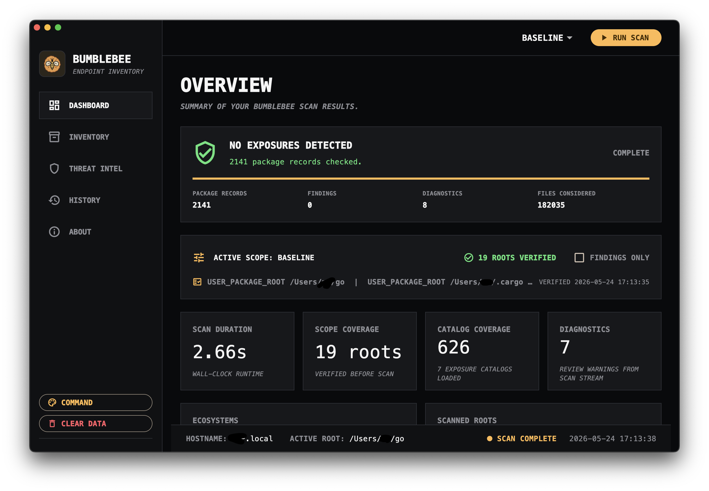

# Bumblebee Desktop

Bumblebee Desktop is an endpoint inventory app for local developer-machine supply-chain checks. It wraps the [Bumblebee scanner](https://github.com/perplexityai/bumblebee) in a desktop UI for scan scope selection, package inventory review, diagnostics, exposure findings, history, and threat catalog management.

The app is designed around the upstream scanner's incident-response model: when a known package, extension, or version appears in a [Bumblebee threat catalog](https://github.com/perplexityai/bumblebee/tree/main/threat_intel), does this endpoint have an exact local match in package metadata?

## Download

Signed desktop builds are published on the GitHub releases page:

- [Apple Silicon DMG](https://github.com/drmhse/bumblebee-ui/releases/latest/download/Bumblebee-1.0.1-2-arm64.dmg)
- [Intel Mac DMG](https://github.com/drmhse/bumblebee-ui/releases/latest/download/Bumblebee-1.0.1-2-x64.dmg)
- [Ubuntu/Linux x64 tarball](https://github.com/drmhse/bumblebee-ui/releases/latest/download/Bumblebee-1.0.1-2-linux-x64.tar.gz) - early, untested package; issues are welcome.
- [All releases](https://github.com/drmhse/bumblebee-ui/releases)

## Website

Public site: https://bumblebee.drmhse.com

## What The App Shows

- Verified scan scope before scans run.
- Exact scan progress from the scanner stream: package records, findings, diagnostics, files considered, duration, and completion state.
- Inventory browsing with package search, ecosystem filters, confidence labels, root filters, and pagination.
- Exposure findings from bundled or synced threat catalog JSON files.
- Diagnostics for malformed local configs or skipped scan inputs.
- About, attribution, version, repository, and catalog provenance information.

## Threat Catalog Source

Bumblebee Desktop bundles catalog JSON files copied from the upstream Bumblebee scanner project and can sync current catalog files from:

`https://raw.githubusercontent.com/perplexityai/bumblebee/main/threat_intel/`

The scanner and catalog format come from:

`https://github.com/perplexityai/bumblebee`

## Local Build Notes

The Flutter app source is built from the local `app/` project in this working tree. The release packages contain:

- the Bumblebee desktop application
- Apache 2.0 license text
- distribution notice and upstream attribution

The bundled helper binaries are built from upstream Bumblebee `v0.1.1` for each target architecture and pruned so each package carries only the matching helper.

## Security Posture

Dependencies are pinned. Release preparation runs a dependency-age audit so newly published registry packages are not silently introduced immediately before release.

The desktop app performs local scans through a bundled helper binary. It does not need cloud ingestion to show local inventory, diagnostics, or catalog matches.

## License

This repository is licensed under the Apache License, Version 2.0. See [`LICENSE`](LICENSE).

The bundled scanner and catalog format are derived from the upstream Bumblebee project, also licensed under Apache 2.0. See [`NOTICE`](NOTICE) for attribution.
